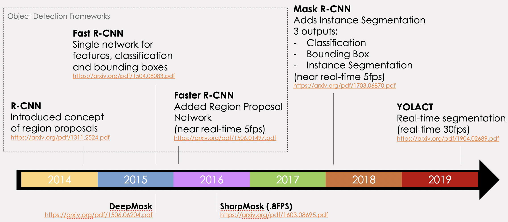
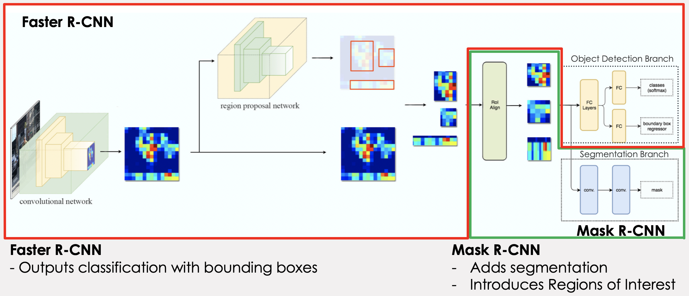
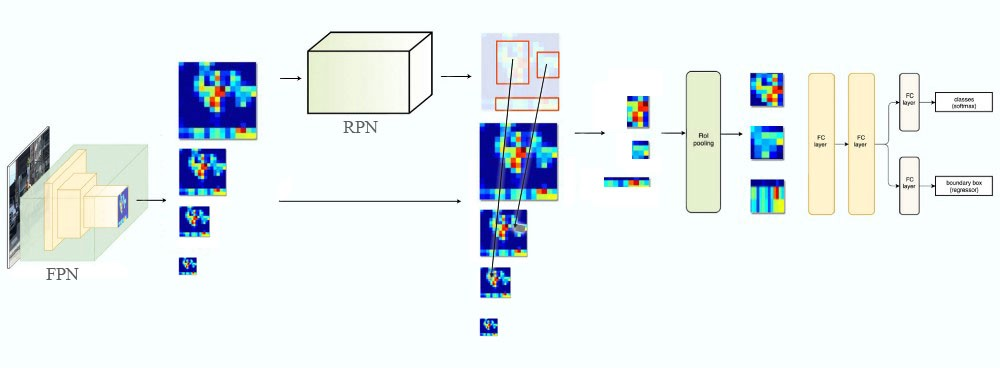

# Fashion Recommendation
- - -
Recently, computer vision applications have attracted significant attention in the fashion domain. A historically challenging task has been to build an intelligent recommender system that can suggest items for purchase, based on a semantically rich notion of “personalized style”. Despite the seemingly insurmountable complexity of this task, the lucrative end reward has enticed e-commerce behemoths like Amazon [1], Stitch Fix, and Pinterest [2] to participate in a race to develop recommender systems that can understand notions of style.

A recent paper describes a system that can take in “in the wild” scene images to generate complementary items recommendations [4]; however, the model training involves inefficient cropping heuristics that fail on certain clothing items, complicated attention mechanisms to detect each item of clothing in an image, and a manually-curated dataset. The authors remark that constructing appropriate ground truth data to learn the notion of compatibility is a significant challenge due to the amount of human effort to label and categorize.

The effort described in this paper aims to use existing methods to provide a quality instance segmentaiton of fashion items and their attributes using data provided from the 2019 Kaggle iMaterialist [6][7] challenge.

This effort focuses on the implementation of a Mask R-CNN model and covers the major components of this framework that deliver a state-of-the-art semantic segmentation.  The Matterport implementation of Mask R-CNN [12] is used as a supporting framework to implement the model into which the iMaterialist data is loaded and trained.

A brief discussion on the most recent iteration of this infrastructure, YOLACT, is reviewed where real-time segmentaiton has become a reality.

- - -

<a name=toc></a>
## Table of Contents

1. <a href=#sec1>Instance Segmentation Overview</a>
2. <a href=#sec2>Related Work</a>
3. <a href=#sec3>Mask R-CNN Explained</a>
4. <a href=#sec4>Implementation</a>
5. <a href=#sec5>Other Models</a>
6. <a href=#sec6>Lessons Learned / Improvements</a>
7. <a href=#sec7>Conclusion</a>
8. <a href=#sec8>References</a>

- - -

<a name=sec1></a>
## 1. Instance Segmentation Overview
<a href=#toc>back to table of contents</a><br>
Instance segmentation is the task of identifying object outlines at the pixel level. It's one of the most difficult tasks in computer vision. Instance segmentation is challenging because it requires the correct detection of all objects in an image while also precisely segmenting each instance. Figure 1 illustrates the differences between the different computer vision tasks.

<br>

<center>
**Types of Object Identification**
<p float="center">
   
</p>

**Figure 1**: Types of Object detection and segmenation <a href=http://cs231n.github.io/transfer-learning>(http://cs231n.github.io/transfer-learning)</a> <br>
</center>

<br>

Semantic segmentation has the goal of classify each pixel into a fixed set of categories without differentiating object instances.  Instance segmentation expands on elements from the classical computer vision tasks of object detection but segmenting pixels within each localized bounding box.  

<a name=sec2></a>
## 2. Related Work
<a href=#toc>back to table of contents</a><br>
Object detection has become a primary focus of computer vision tasks over recent years.  In 2015, FaceBook Research introduced a viable instance segmentation architecture with DeepMask [13].  Less than a year after publishing DeepMask, the same team published an iterative improvement called SharpMask [14] which addressed many of the DeepMask inaccuracies.  DeepMask and SharpMask did not use skip connections and focused on refining a prposed mask using convolution.  Inference times of the improved SharpMask were ~.8s per frame.  At the same time, the R-CNN family of object detection architectures were under going a series of iterative improvements with the publication of Fast R-CNN and Faster-RCNN.  Although these focused on object detection, they became the precursor to instance segmenation architecture of Mask R-CNN.  By focusing on segmentation first and then classification, DeepMask and SharpMask proved slow to train and predict as well as a high rate of misclassifications.  Mask R-CNN performs the same task as DeepMask and SharpMask but does so in parallel to the classification task improving both speed and accuracy.

This paper focuses on how Mask R-CNN works and its evolution.


<a name=sec3></a>
## 3. Mask R-CNN Explained
<a href=#toc>back to table of contents</a><br>

### Evolution of Mask R-CNN
Mask R-CNN is the evolution of not a segmentation architecture, but rather the RCNN object detection architecure.  The timeline in Figure 2 shows the papid progress since R-CNN was introduced in 2014 and how it developed into the instance segmentation architecture of Mask R-CNN in 2018.  In 2019, Mask R-CNN was refined by the YOLACT instrastructure which dramatically improved inference time allowing real-time segmenation of images, albeit with lower accuracy.

During the evolution of R-CNN, FaceBook Research published both the DeepMask and SharpMask architectures making them the start-o-the-art at that time.  Mask R-CNN became the new standard after its implementation in 2018.

<br>

<center>
**Instance Segmentation Timeline**
<p float="center">
   <br>
  **Figure 2**: Mask R-CNN is an iterative evolution of the original R-CNN structure.  YOLACT has recently been developed adding real-time inference to instance segmentaiton tasks.
</p>
</center>

<br>

### Mask R-CNN Architecture
The following figure shows the complete Mask R-CNN structure with the Faster R-CNN base separated out.  This shows how Mask R-CNN fits into the R-CNN evolution.  (The evolution before Faster R-CNN is not depicted for understandability.)  The complete Mask R-CNN network (regional convolutional neural network) is a two stage framework: 
1. Stage 1 scans the image and generates proposals(areas likely to contain an object) using a Regiona Proposal Network. 
2. Stage 2 classifies the proposals and generates bounding boxes and masks.

Mask R-CNN contributes to the second stage of this process by creating masks from the Faster R-CNN's Regional Proposal Outputs.

<br>

<center>
**Mask R-CNN Architecture**
<p float="center">
   <br>
  **Figure 3**: Mask R-CNN adds segmentation by inserting a process to analyze Faster R-CNN's proposed regions of interest. <br>
(Source image from <a href=https://medium.com/@jonathan_hui/image-segmentation-with-mask-r-cnn-ebe6d793272>https://medium.com/@jonathan_hui/image-segmentation-with-mask-r-cnn-ebe6d793272</a>)

</p>
</center>

<br>

###Network Components
1. Convolutionan Network:
	- Convolutional Base
	- Feature Pyramid Network (FPN)
2. Region proposal network (RPN)
	- Anchors
	- Outputs
	- Architecture
	- RPN and FPN
3. Region of Interest (ROI align)
3. Object detection branch (bounding box and classification)
4. Segmentation branch (pixel-level assignment of classes)

--- 
### 1. Convolutional Network


#### Convolutional Base
Figure 4 depicts the pyramid structure of a CNN network.  Each layer on the left side of the image is convolved reducing the dimensions of the image while increasing its depth.  This has the effect of capturing spatial features of the image while losing surface details.  The left side of the structure leading up to the encoding can be referred to as a convolutional base.

<br>

<center>
**Encoder / Decoder Pyramid Structure**
<p float="center">
   <br>
  **Figure 4**: The encoder part of a pyramid network where each level in the pyramid is a <br> convolution of the previous level increasing the depth but decreasing the x/y dimensions.
</p>
</center>


The convolutional base is refrred to as a backbone when it is imported as a pre-trained network (eg, ResNet50, ResNet101, MobileNet, VGG, etc). These are networks that are pre-trained on a large catalog of images.  These networks can be imported with only the left hald (encoder) part of their network allowing the right side (decoder) to be trained using a custom or different architecture.  


### Feature Pyramid Network

The main purpose of the encoder is to construct feature maps to extract features from images. The early layers detect fine features (edges and corners), and the later layers detect broader features like complete identifiable objects. As each layer increases in depth, the surface dimension gets smaller which essentially trades image surface details for information about the shapes in the image.

We can think of the convolutional base as constructing a pyramid of feature maps (feature pyramid).


<center>
**Tradeoff Between Resolution and Semantic Meaning**
<p float="center">
   <br>
  **Figure 5:** Each level of the pyramid decreases its resolution but <br> increases its ability to recognize features (semantic values) of an image. <br>
<a href=https://arxiv.org/pdf/1612.03144.pdf>https://arxiv.org/pdf/1612.03144.pdf</a></p>
</center>


However, computer vision tasks using only the high level feature maps will suffer in performance for small objects, while the low-level feature maps are not effective for accurate object detection. The feature pyramid network (FPN) takes the feature maps from the backbone and improves the feature extraction by having another pyramid that takes the high level features from the first pyramid and passes them down to lower layers. By doing so, it allows features at every level to access to both lower and higher level features. The conceptual schematic of FPN is below.


<center>
**Skip Connections Between Layers**
<p float="center">
   <br>
  **Figure 6:** Each level of the enocder side of the pyramid shares semantic meaning with the decoder side <br> of the pyramid in order to help form properly formed segmentations in the final image.>
  </p>
</center>

The second pyramid consists of layers that are upsampled using the encoded layer of the first pyramid.  The reconstructed layers are semantic strong but the locations of objects are not precise after all the downsampling and upsampling. Therefore, we concatenate feature maps of similar size from the first pyramid to the second pyramid on the right to help the detector to predict the location better. It also acts as skip connections to make training faster.


### Region Proposal Network

The region proposal network (RPN) receives the feature maps from the various levels of the feature pyramid. The RPN scans the image in a sliding-window fashion and finds areas that contain objects (region proposals or regions of interest).

#### Anchors
Because scanning each possible region in an image would be computationally expensive, the image is broken down into prescribed regions which are scanned.  The prescribed regions that the RPN scans over are called anchors.
Anchors are boxes distributed over the image area. In the Mask-RCNN implementation, **there are about 200k anchors of different sizes and aspect ratios**. Here, we are just showing one anchor size. Also, **we are showing the anchors on the image, while in practice, the anchors are regions on the feature maps**.This allows the RPN to reuse the extracted features efficiently and avoid duplicate calculations.


<center>
**The Anchors of a Region Proposal Network**
<p float="center">
   <br>
  **Figure 7:** An example of anchors of one size in an image. <br>
	<a href=https://engineering.matterport.com/splash-of-color-instance-segmentation-with-mask-r-cnn-and-tensorflow-7c761e238b46>https://engineering.matterport.com/splash-of-color-instance-segmentation-with-mask-r-cnn-and-tensorflow-7c761e238b46</a>
</p>
</center>


#### What does a region proposal consist of?
The RPN slides 3x3 filters over the anchors on the feature maps to make regional proposals, which consist of a **boundary box prediction** via regression (4 x (x,y) coordinates of the bounding box) and an **objectness score** (a binary classification probability between "contains object" and "does not contain object"). 

For each anchor, a series of boxes of different size and aspect ratio are created.  The number of sizes and rations is user defined and represented by `k`.  So from every anchor box a series of boxes are proposed.  Each box will be evaluated for the presence of an object.  Therefore, within one feature map, for each anchor location we will have `4 * k` bounding box coordinates and ` 2 * k` scores. 

The diagram below shows the 8 × 8 feature maps with a 3 × 3 filter, and it outputs a total of 8 × 8 × 3 ROIs (for k = 3). The right side diagram demonstrates the 3 proposals made by a single location.


<center>
**Proposed Regions from Anchors**
<p float="center">
   <br>
  **Figure 8** : Regions of interest for each point in a feature mapping 
</p>
</center>


#### Region proposals for each anchor of different sizes and aspect ratios

To summarize, Mask-RCNN's RPN component uses 9 anchor boxes: 3 different scales at 3 different aspect ratio. These anchors are diverse and cover real-life objects at different scales and aspect ratios reasonable well. This guides the initial training with better guesses and allows each prediction to specialize in a certain shape. This strategy makes early training more stable and easier.

Using 9 anchors per location, it generates 2 × 9 objectness scores and 4 × 9 coordinates per location. The outputs are **regions of interests (ROI)** 


<center>
**Evaluating Anchors for Content**
<p float="center">
   <br>
  **Figure 9:** Calculation of scores and coordinates for each anchor. <br>
<a href=https://medium.com/@jonathan_hui/what-do-we-learn-from-region-based-object-detectors-faster-r-cnn-r-fcn-fpn-7e354377a7c9>https://medium.com/@jonathan_hui/what-do-we-learn-from-region-based-object-detectors-faster-r-cnn-r-fcn-fpn-7e354377a7c9</a>
</p>
</center>

#### RPN architecture
The regression task for bounding box and classification task for "has object or not" can be achieved by standard convolutional layers, followed by two fully connected heads: one for bounding box regression and the other for classification.  Figure 12 depicts the Region Proposal Network on the left and how it creates proposed regions with bounding boxes and scores for each box.  Note that only the last layers of the Feature Pyramid is evaluated.


<center>
**Region Proposal Architecture**
<p float="center">
   <br>
 **Figure 10:** The RPN uses scores and coordinates to determine classes and bounding boxes. <br>
<a href=https://medium.com/@jonathan_hui/what-do-we-learn-from-region-based-object-detectors-faster-r-cnn-r-fcn-fpn-7e354377a7c9>https://medium.com/@jonathan_hui/what-do-we-learn-from-region-based-object-detectors-faster-r-cnn-r-fcn-fpn-7e354377a7c9</a>
</p>
</center>

#### Connecting RPN and FPN

Once proposed regions are generated, each is evaluated for the possible existence of an object.  Once these are selected, respective regions from the other pyramid scale levels are selected that best represent the object based on its size/scale.  The result is a composite feature map with different regions being patches from different-scale layers of the top-down feature pyramid.


<center>
**How RPN Fits into the Overall Fast R-CNN Architecture**
<p float="center">
   <br>
 **Figure 11:** Mask R-CNN inserts an ROI Pooling layer in the model <br> before classification and bounding boxes are calculated. <br>
<a href=https://medium.com/@jonathan_hui/understanding-feature-pyramid-networks-for-object-detection-fpn-45b227b9106c>https://medium.com/@jonathan_hui/understanding-feature-pyramid-networks-for-object-detection-fpn-45b227b9106c</a>
</p>
</center>

The formula to pick the feature maps is based on the width w and height h of the ROI.

<center>

</center>

`k0` is a user-defined parameter (default: 4), and `k` is the layer in the FPN to be used for the feature patch. So if `k = 3`, we select P3 for the patch for that ROI.

The RPN generates two outputs for each anchor:

Anchor Class: One of two classes: foreground or background. The FG class implies that there is likely an object in that box.

Bounding Box Refinement: A foreground anchor (also called positive anchor) might not be centered perfectly over the object. So the RPN estimates a delta (% change in x, y, width, height) to refine the anchor box to fit the object better.

Using the RPN predictions, we pick the top anchors that are likely to contain objects and refine their location and size. If several anchors overlap too much, we keep the one with the highest foreground score and discard the rest.

#### ROI Align

In order to do classification and instance segmentation, we would need to feed the ROIs that likely to have an object (foreground class) into the two output heads . 

One head is a fully connected layer whose outputs are 1) the four bounding box coordinates for the object and 2) probability prediction for all the classes in the dataset. The class that the object belongs to will be the one with highest probability. The other head is a fully convolutional layer that outputs one mask for each object.

However, classifiers do not handle variable input size well, therefore we need to apply the ROI Align step to make all inputs to the output heads the same size. ROI Align was introduced by authors of Mask-RCNN paper as an improvement of ROI Pooling. In ROI Pooling, for every region of interest from the input list, it takes a section of the input feature map that corresponds to it and scales it to some pre-defined size. The steps for scaling are:

1. Dividing the region proposal into equal-sized sections (the number of which is the same as the dimension of the output)
1. Finding the largest value in each section
1. Copying these max values to the output buffer

An illustration of ROI Pooling is below:


In ROI Pooling, the warping is digitalized (top left diagram below): the cell boundaries of the target feature map are forced to realign with the boundary of the input feature maps. Therefore, each target cells may not be in the same size (bottom left diagram). Mask R-CNN uses ROI Align which does not digitalize the boundary of the cells (top right) and make every target cell to have the same size (bottom right). It also applies interpolation to calculate the feature map values within the cell better. For example, by applying interpolation, the maximum feature value on the top left is changed from 0.8 to 0.88 now.


Comparison of ROI Pooling and ROI align. Source: https://miro.medium.com/max/1496/1*en2vHrpgp0n3fLi2QKJOKA.png


**Output Branches**

1. Classification
   * The same classification process is done here as is done with Faster R-CNN.  The probability of classification is calculated.
2. Bounding Box Regression
   * The bounding boxes are refined using regression
3. Mask
   * Each pixels is evaluated for inclusion in a classification mask.  This is process intensive addition to the faster R-CNN process which increases train and inference time.

Each branch produces a unique output.


<a name=sec4></a>
## 4. Implementation
<a href=#toc>back to table of contents</a><br>

In this project, we utilized an open-source implementation of Mask R-CNN model provided by Matterport[12] and applied it on the recently release iMaterialist Dataset[7] which focuses on clothing apparels and attributes in scene-based images. We apply the Mask R-CNN model that was initially trained on the COCO dataset and fine-tune it for the iMaterialist Dataset images to obtain instance-level segmentation outputs. 

Training was achieved in multiple runs with each run tuning the Mask R-CNN hyperparameters and/or the dataset with difference strategries to achieve the lowest model losses. We complete four runs of training hereby referred to as **Baseline, Run 1, Run 2,Run 3**

### Dataset
The iMaterialist Dataset[7] is a rich dataset consiting of ~45k unique training images with over ~330k unique pixel-wise instance-level annotations. Each annotation represents an instance of a segmented clothing apparel in the image e.g. shirt, top, skirt, shoe, etc. The dataset also consists of ~3k unlabeled test images for the purposes of the online competition discussed below.

The Dataset is presented as a set of JPEG images of varied dimensions and single CSV database file listing out the pixel-wise annotations for each image. The CSV file provides key attributes for each image including Image ID, Annotation Mask encoded in Run-Length Encoding(RLE), Image Dimensions and the Class ID for each annotation. Overall, the Dataset contains annotations spanning 46 unique categories of clothing apparels. It is important to note that in the original Dataset, the Class ID is obtained by concatenating both segmented apparel object index and predicted attributes' indices for this object. 
e.g 6_28_77 → Category: Pants(6) ; Attributes: Bell(28), Leopard(77). The fine-grained attributes add an additional level of complexity to an already ambitious segmentation task, hence, for the purposes of this project, we discarded all fine-grained attributes from the annotation and only focused on the 46 primary apparel categories. Using the example above, the Class ID for the annotation above (6_28_77) would be read as Category: Pants (6) with the detailed attributes disarded prior to training. 

Compared to the COCO Dataset, the iMaterialist Dataset is closer to a real-world application with a variety of objects resembling clothing apparels. iMaterialist also boasts of a much better labeling quality and is more fine-grained, so the general contour of the masked objects is of high quality and well preserved. This requires our training model to be more robust in order to learn detailed masking and tolerate diversity in categories.

The iMaterialist Dataset was presented as an open online challenge on Kaggle. The challenge submissions were evaluated on the basis of segmenting fine-grained clothing apparels on a set of ~3k test images. iMaterialist does not publish literature explaining the usage or implementation of the data due to the propieatary novelty of the iMaterialist dataset. The online challenge ended in June 2019 with over 241 submissions ranging from a wide variety of implementations using pre-trained and novel instance segmentation frameworks. At the close of the competition, the mean average precision (mAP) for all submissions remained low with the highest precision reported at **0.32**. 

### Exploratory Data Analysis
We started the segmentation task by taking a deep dive into the iMaterialist Dataset using the base set of files provided with the challenge. The crux of the information is provided in the CSV database file listing out the pixel-wise annotations for each image.

<center>
**The iMaterialist Mask Definitions in CSV File**
<p float="center">
   <br>
 **Figure 12:** *(Left)*Sample dataframe from iMaterialist Train CSV file,*(Right)*Corresponding image with annotations overlaid<br>
</p>
</center>


The database consists of **45625** unique training image filenames with a total of **333415** pixel-wise annotations. The maximum number of ground truth annotations for a given image is **74** with the average number of annotations per image is roughly around **7.3**.

With regards to the apparel categories, the database has annotations for **46** unique apparel categories, however, the number of annotations per category does not follow a uniform distribution. In actuality, there is a huge disparity in number of annotations per category as depicted in ***Figure 13***. The maximum number of annotations for a given category is **59452(sleeve)** and the minimum number of annotations for a given category is **112 (leg warmer)** with median number of annotations being close to **3212**. It is important to note here that even with the disparity in representation of each category, the prime categories of apparels (e.g. shirt, jacket, pants, jackets, shoe, dress) are well represented in the dataset.

Additionally, the training images reflect a wide distribution of dimentions ranging from **(10717,6824)** to **(236, 304)** being the maximum and minimum dimensions(W,H), respectively. 

<center>
<p float="center">
   
</p>
**Figure 13:** Distribution of annotations per apparel category <br>
</center>

<br>
As mentioned above, the dataset also consisted about **3201** test images for the purposes of the online competition scoring.  These images did not containg corresponding annotation labels and were not used for this project.

<center>
<p float="center">
   
</p>
**Figure 14:** Set of sample images from training dataset with masks overlaid<br>   
</center>
<br>

### Data Preparation and pre-processing
For the purposes of training the data using the Mask R-CNN Matterport implementation, the iMaterialist Dataset was converted into a COCO-style database format. Matterport's Mask R-CNN implementation provides a robust set of API tools to assist in this data generation task. The details of the this data generation exercise is documented well in our code base, we discuss a few high-level details here.

The COCO-style dataset expects the data to be provided as a Python class objects which extends a `utils::Dataset` class. The class object at a high-level maintains a reference to the entire dataset as a dictionary of images with the following minimum set of fields for each image
```
dict (
    “source”: <source_id>,
    “id”: <image_id>,
    “path”: <filepath>,
    “width”: <width>,
    “height”: <height>,
    “annotations”: = dict(
        “mask”: <binary_or_rle_masks>,
        “class_id”: <class_ids>,
        “iscrowd”: <binary_or_rle_flag> 
))
```   

We then overload the `load_images()` and `load_mask()` methods in the `utils::Dataset` class to finalize the creation of our custom dataset object.

Once loaded into the COCO-style format, the images, annotations and bounding boxes become much easier to manipulate and visualize as seen from some of the examples provided below.

<p float="center">
    
     
</p>

<center>
**Figure 15:** Set of sample images from training dataset in COCO-style format<br>
</center>
<br>

We did not apply any further pre-processing steps to the dataset or to the images prior to training. By default, Mask R-CNN model resizes all input images to a fixed size of *1024 px x 1024 px*. The non-square image is padded with all zeros, where the smallest side is 800 px and the largest is trimmed at 1000 px. Unless otherwise noted, all training runs used these default parameters.

### Dataset Usage
We split the the distribution for the dataset for training and validation as shown in *Table 1*. We applied a 80/20 split between training/validation data for each run while also using a label stratification strategy in **Run 4** to distribute the annotations evenly.

<center>

| Name     | Training       | Validation | Strategy  |
| :-------- | :-------------: | :---------: | :--------: |
|**Baseline**  | Images: 8032<br>Masks:8044 | Images: 1968<br>Masks: 1968 | 80/20 split<br>Limit: 10k |
|**Run 1**  | Images: 36596<br>Masks: 267842| Images: 9029<br>Masks: 65573 | 80/20 split |
|**Run 2**  | Images: 36596<br>Masks: 267842| Images: 9029<br>Masks: 65573 | 80/20 split |
|**Run 3**  | Images: 45418<br>Masks: 266732| Images: 33715<br>Masks: 66683| 80/20 split<br>Stratified |


**Table 1:** Train/Test Images for each training run.
</center>

### Training Summary 

We adopted the general transfer-learning approach for training Mask R-CNN on our custom dataset. The pre-trained COCO Dataset weights for Mask R-CNN were used as the starting weights during training of each run. We experimented with additional methodologies to improve better model accuracy as discussed in this section below. Training was completed on an NVIDIA GTX 1070GT (8 GB) graphics card.

### Data Augmentation
Since the iMaterialist dataset is fairly rich with high quality fine-grained annotations, we did not rely heavily on augmentation to improve the accuracy of our model. The general strategy was to train the 'head' layers of Mask R-CNN without any data augmentation and then to fine-tune the model by training all layers with data augmentation. The following few augmentation tasks were applied at random to the image dataset:

* Vertical Flip
* Horizontal Flip
* Random Crops (0-10%)
* Gaussion Blur (sigma=0-0.5) applied to only 50% images
* Contrast Normalization (0.75-1.5)
* Additive Gaussian Noise
* Brighten/Darken Images
* Affine Transformations (Scale(0.5.15), Rotate (-45,45), Translate(-0.2, 0.2), Shear(-8,8))

Data augmentation tasks were only applied to 80% of the total training batch size.

### Hyper-parameters tuning
Mask R-CNN provides a variety hyper-parameters which can be tuned to achieve better accuracy when training on custom datasets. While the list of parameters is fairly extensive, we only tuned a few parameters based on our general understanding of the Mask R-CNN framework.

We set up a baseline run with all default hyper-parameters similar to the COCO dataset training task. The Batch Size was kept limited to 1-2 in each run to limit memory outages when training the vast set of images in our dataset. In all runs, we utilized the SGD optimizer for training with a variable learning rate strategy based on number of epochs as detailed in the table below. We also modified the backbone of the Mask R-CNN to 'resnet50' from the default 'resnet101' to avoid strains on memory during training.

For the baseline run and Run 1, we trained only the 'head' layers of the Mask R-CNN which corresponds to the Fully Connected Layers used for object detection and classification. Only, in Runs 2 and 3, we further fine-tuned the model by training all layers after training the 'head' layers with an augmented dataset. Finally, only in Run 3 did we truly train the model on the entire dataset, in all other runs the steps / epoch were limited to 1000 shuffled images. 

<center>

| Name     | LR       | Batch Size | Epochs  | Steps/Epoch | Layers | Augmentation  |
| :--------| :------: | :--------: | :-----: | :---------: | :----: | :-----------: |
|**Baseline**| 1e-3   |		 1	   |	1	 | 	  1000     |  head  |      ---      |
|**Run 1**| 1e-3   |		 1	   |	20	 | 	  1000     |  head  |      ---      |
|**Run 2**| 1e-3   |		 1	   |	20	 | 	  1000     |  head  |      ---      |
|**Run 2**| 1e-4   |		 1	   |	20	 | 	  1000     |  all   |      yes      |
|**Run 2**| 1e-5   |		 1	   |	20	 | 	  1000     |  all   |      yes      |
|**Run 3**| 1e-3   |		 2	   |	5	 | 	  22709    |  head  |      ----     |
|**Run 3**| 1e-4   |		 2	   |	5	 | 	  22709    |  all   |      yes      |

**Table 2:** Metadata Summary of Runs 
</center>

### Results & Evaluation

The instance segmentation results on four randomly chosen images from the iMaterialist dataset is shown in Fig 17. The network delivered generally acceptable results with the training strategies detailed above with the highest model accuracies reported on Run 3 when the network was trained on the entire dataset.

## Training History

The figures below describe the training losses for Runs 1-3. The baseline run was run for a single epoch hence we did not include the training history for that run. For all the other three runs, we see a gradual improvement in training losses with each successive epoch. The best model from each run was chosen from the history by looking at the lowest validation loss across all epochs. In all three runs, we notice the training losses start to plateau at different points in the training cycle.

Run 2 had the most number of epochs during the training cycle and we see the training losses improve only marginally after Epoch#20. It is important to point our here that during Run 2, the model was trained with augmented dataset with all layers set to trainable after Epoch # 20. This re-affirms our claim made above that augmentation is expected to have very little impact in improving the model accuracy after a certain point.

<p align="center">
    
     
</p>
<p align="center">
     
</p>

<br>
<center>

**Figure 16:** (L-R) Training Losses for Run 1,2 and 3<br>
*NOTE: Run 3 crashed after Epoch#7 and was never resumed*
</center>
<br>

### Evaluation Metrics
Our common approach to evaluate instance segmentation performance is average precision (AP) over all possible classes under a certain Intersection-over-Union (IoU) threshold. 

The value for IoU threshold is referenced from MS COCO dataset evaluation metrics[13] with fixed IoU thresholds as 0.50 (*AP.50*), 0.75(*AP.75*) as well as the average AP value over [0.50, 0.95] with increment of 0.05 (*AP*).

We consult results from Facebook and Matterport[12] evaluated on the MS COCO dataset as benchmarks. Evaluation metrics were calculated for each run by selecting the model with lowest validation losses and calculating the metrics on batch of 100 random images from the validation dataset used for training during the respective runs. The results are organized in ***Table 3*** below


<center>

|      	     | Dataset  | Classes    | AP      | AP.50       | AP.75  |   Training Time |
| :--------  | :------: | :--------: | :-----: | :---------: | :----: | :----------:	|
|**Facebook**|  COCO    |    80      |  37.1   |    60.0     |   39.4 | 		---	|
|**Matterport**|  COCO    |    80      |  35.1   |    59.4     |   36.5 |	---	|
|**Baseline**|  iMaterialist    |    46      |  11.9   |   20.8     |   13.2 | 15 mins	|
|**Run 1**|  iMaterialist    |    46      |  17.0  |   30.3     |   17.5|  3 hours	|
|**Run 2**|  iMaterialist    |    46      |  22.4  |   38.8     |   22.6|  11 hours | 
|**Run 3**|  iMaterialist    |    46      |  30.6  |   51.3    |   31.8|   45 hours | 

**Table 3:** Evaluation metrics comparison of Mask R-CNN framework with multiple implementations and multiple datasets
</center>


Our results show that model trained on Run 3 (entire dataset + fine-tuning + augmentation) achieves comparable results to Mask R-CNN networks trained on the MS COCO dataset when evaluated over a limited batch of test images. The table is included here to demonstrate the improvement in evaluation metrics for our network with each run and figures reported on similar tasks on other datasets. However, as mentioned before the quality and category of classes in MS COCO versus the iMaterialist dataset are significantly different hence it is not a fair comparison to start with.  We believe that model accuracy can be further improved through hyper-parameters tuning and better stratification strategy for splitting the dataset for training and validation. 

### Sample Results
We added four examples of model predictions from Run 3 on random images picked from the dataset. The model seems to do a good job at detecting primary clothing apparels including dress, pants, shoes, tops, etc. There are occasions when the predictions do not match the ground truth, for example in the top left image, an area of the scarf is detected as a watch, in the top right image the shirt and pants combination is detected as a dress instead of two separate apparels. The confusion matrix of predictions is further discussed below using a single prediction image as an example. In general, we observe that the model is good with detecting objects with no overlap with other objects e.g. shoes, pants, hats, glasses, etc but does a worse job when overlaps are involved, e.g. shirts, sleeves, dresses, etc.

<p align="center">
    
</p>

<center>

**Figure 17:** Sample instance segmentation results in 46 classes.
</center>
<br>

The image below which was taken from the dataset and run through our model to provide detected predictions. The masks are presented as molded overlays where the green outlines represent the ground truth masks and the red outlines represent the predicted masks. We notice that in most instances the ground truth and predictions align fairly well. There are also instances where the model predicted what appears to be a bag between the two persons but is clearly a pattern from the background. The precision-recall curve for the same image and the confusion matrix support the visual results that model detected the objects with good accuracy in this particular instance.

<p align="center">
    
    
</p>

<p align="center">
    
</p>

<center>
**Figure 18:** (L)Sample image with Ground Truth and Predictions, (R) Precision-Recall Curve<br>
(Bottom) Confusion Matrix

</center>

<br>

We also ran predictions on a real-world image the results of which are included below.

<center>
<p align="center">
**Real-World Image of Prospective Computer Vision Data Scientists**
    
</p>

**Figure 19:** Model predictions on a real-world image
</center>
<br>

<a name=sec5></a>
## 5. Other Models
<a href=#toc>back to table of contents</a><br>

In order to extend our dataset to other models, we made attempts to train a UNET and YOLACT model in order to compare and contrast with Mask RCNN.  Unfortuntately, this proved more challenging than expected:

#### UNET
During data exploration, we attempted to train a UNET model on the dataset.  Although UNET will only provide segmentation and not instance segmenation, we felt that the comparison of a raw model implementation without using a pre-existing implementaiotn would be a useful exercise.  We tried training from scratch as well as with pre-trained weights.  Both versions were trained with the entire dataset in each epoch.  

Results were poor and required extensive training.  Below is an example after 50 epochs of training:

<br>
<center>
<p align="center">
**UNET Semantic Segmentation of iMateriaslist Data**
    
</p>

**Figure 20:** UNET example of iMateriaslist image
</center>
<br>


#### YOLACT
As YOLACT was published during our initial project, only one stable implementation was available to use to try.  We did not attempt to build our own YOLACT implementation.  We were not successful in getting the model to work
(<a href=https://github.com/dbolya/yolact>https://github.com/dbolya/yolact</a>)

State of the art approaches to instance segmentation like Mask R-CNN directly builds off of advances in two-stage object detection algorithms like Faster R-CNN. However, these methods focus primarily on performance over speed, which make them unsuitable for real time instance segmentation. YOLACT aims to fill that gap with a fast, one-stage instance segmentation model in the same way that SSD and YOLO fill that gap for object detection.

The slow step for the two stage algorithms is “repooling” features in some region of interests (e.g., via RoIpool/align), and then feed these now localized features to their mask predictor, since this step is inherently sequential.  YOLACT approaches the instance segmentation from a different perspective the forgoes the feature localization/repooling step. YOLACT breaks instance segmentation into two parallel tasks: 1) creating masks over the entire image and 2) determine linear combination coefficients (can be think of as weights) of these masks for each instance to be segmented. At the inference step, for each instance, linearly combine the prototypes using the corresponding predicted coefficients and then crop with a predicted bounding box.


YOLACT consists of two branches, the first branch uses an FCN [31] to produce a set of image-sized “prototype masks” that do not depend on any one instance. The second adds an extra head to the object detection branch to predict a vector of “mask coefficients” for each anchor that encode an instance’s representation in the prototype space. Finally, for each instance that survives non-maximal suppression, YOLACT construct a mask for that instance by linearly combining the work of these two branches.

<b>Yolact is the first real-time (> 30 fps) instance segmentation algorithm with competitive results on
the challenging MS COCO dataset</b>


<a name=sec6></a>
## 6. Lessons Learned / Improvements
<a href=#toc>back to table of contents</a><br>

Implementaiton of this model was a useful experience.  We note several of the key points learned during this exercise:

* Starting with a pre-created implementation of an architecture is imperative.  Implementing a model based on an academic paper is a challenge.
* Using transfer learning improves model quality and decreases needed training time.
* A sizeable portion of the effort was on understanding data and preparing for training. 
* Understanding the hardware and using capabile hardware are important to ensure reasonable training speeds.
* Meta-parameter tuning is as artist as it is scientific.  The number of possible setting combinations is limitless.  Some knowledge of the settings and their impact is necessary to avoid wasting time on ineffective changes.

Although we felt that our results were positive and that the project was successful, there are improvements we could make:

* Introduce regularization and further augmentation into the model and training process so to avoid performance plateau and improve results.
* Review augmentation to ensure effective use.
* Consider ways to improve training speed: using gray-scale images, smaller image sizes.
* Add fine-details included in dataset which were removed for project.
* Try training model with different bases (e.g. ResNet152)
* Implement YOLACT for real-time segmentation

<a name=sec7></a>
## 7. Conclusion
<a href=#toc>back to table of contents</a><br>

We considered the results of this project successful.  Although we never achieved the end-goal of producing a recommendation, we prvided a solid framework for identifying items of clothings which could be applied to such an application.  We felt that the results of segmenations were very strong as evidenced by metrics that are close to promised from the model description.

<a name=sec8>
## 8. References
<a href=#toc>back to table of contents</a><br>

[1]  Krishnan, A. (2019, June 19). StyleSnap will change the way you shop, forever. Retrieved from aboutamazon.com <br>
[2]  Le, J. (2018, January 14). Pinterest's Visual Lens: How computer vision explores your taste. Retrieved from . Medium.com.<br>
[3]  Kang, W.-C., Fang, C., Wang, Z., & Mcauley, J. (2017). Visually-Aware Fashion Recommendation and Design with Generative Image Models. 2017 IEEE International Conference on Data Mining (ICDM). doi: 10.1109/icdm.2017.30<br>
[4]  Kang, W.-C., Kim E., Leskovec J., Rosenberg C., McAuley J.. Complete the Look: Scene-based Complementary Product Recommendation.<br>
[5]  Veit, A., Kovacs, B., Bell, S., Mcauley, J., Bala, K., & Belongie, S. (2015). Learning Visual Clothing Style with Heterogeneous Dyadic Co-Occurrences. 2015 IEEE International Conference on Computer Vision (ICCV). doi: 10.1109/iccv.2015.527<br>
[6]  Visipedia. (2019, June 26). visipedia/imat_comp. Retrieved from https://github.com/visipedia/imat_comp.<br>
[7]  iMaterialist (Fashion) 2019 at FGVC6. (n.d.). Retrieved from https://www.kaggle.com/c/imaterialist-fashion-2019-FGVC6.<br>
[8]  Kang W., Yang Q.,  Liang R. (2009). The Comparative Research on Image Segmentation Algorithms. IEEE Conference on ETCS. doi: 10.1109/ETCS.2009.417<br>
[9]  He, K., Gkioxari, G., Dollar, P., & Girshick, R. (2017). Mask R-CNN. 2017 IEEE International Conference on Computer Vision (ICCV). doi: 10.1109/iccv.2017.322<br>
[10] Lin, T.-Y., Maire, M., Belongie, S., Hays, J., Perona, P., Ramanan, D., Zitnick, C. L. (2014). Microsoft COCO: Common Objects in Context. Computer Vision – ECCV 2014 Lecture Notes in Computer Science, 740–755. doi: 10.1007/978-3-319-10602-1\_48<br>
[11] iMaterialist (Fashion) 2019 at FGVC6. (n.d.). Retrieved from https://www.kaggle.com/c/imaterialist-fashion-2019-FGVC6/overview/evaluation.<br>
[12] Mask R-CNN for Object Detection and Segmentation https://github.com/matterport/Mask_RCNN 
[13] DeepMask; Learning to Segment Object Candidates, Sept 2015, Pedro O. Pinheiro∗ Ronan Collobert Piotr Dollar, Facebook AI Research (FAIR), https://arxiv.org/pdf/1506.06204.pdf <br>
[14] SharpMask; Learnign to Refine Object Segments July 2016, Pedro O. Pinheiro⋆, Tsung-Yi Lin⋆, Ronan Collobert, Piotr Dollar, Facebook AI Research (FAIR), https://arxiv.org/pdf/1603.08695.pdf