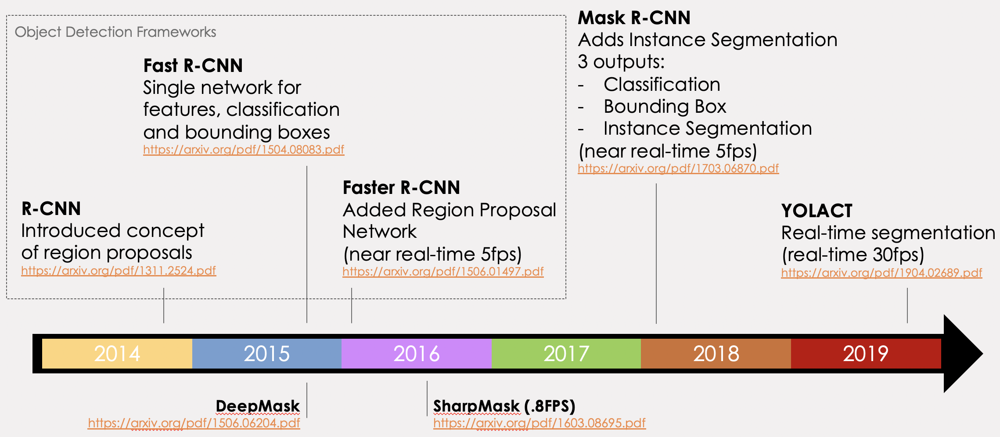
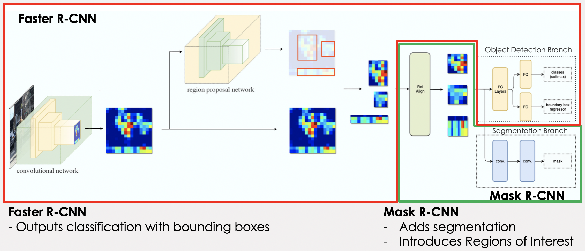
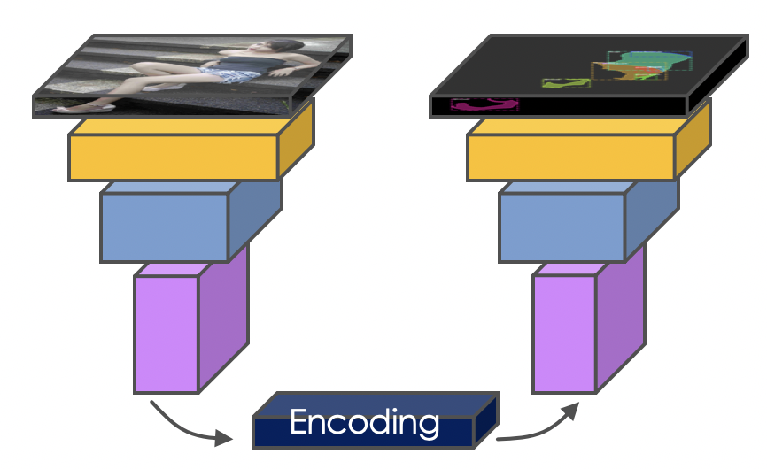
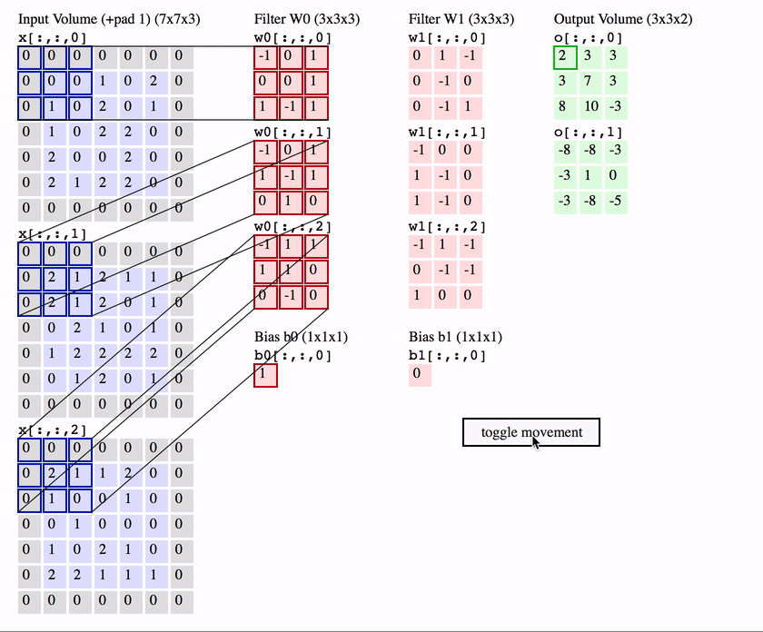
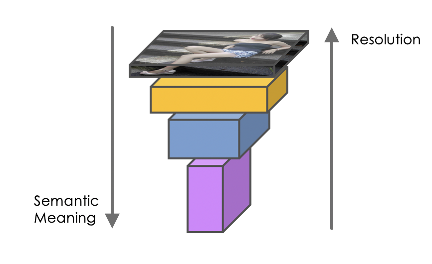
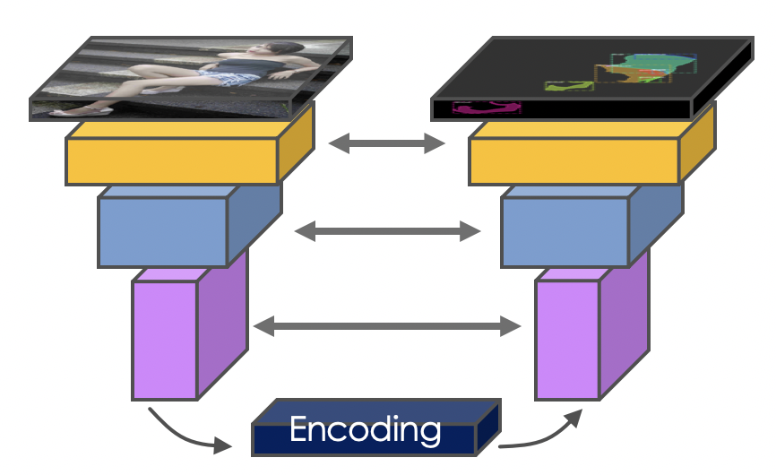
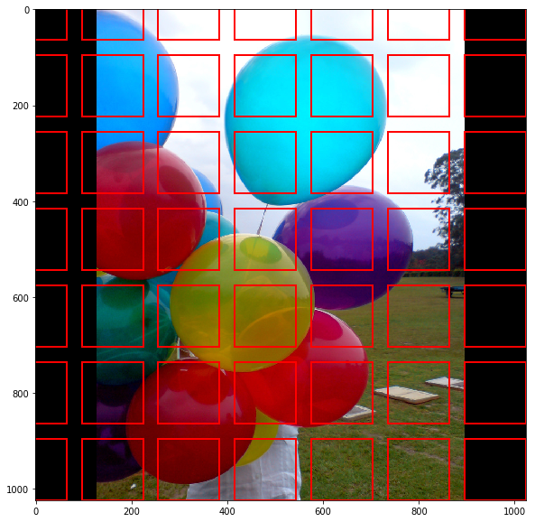
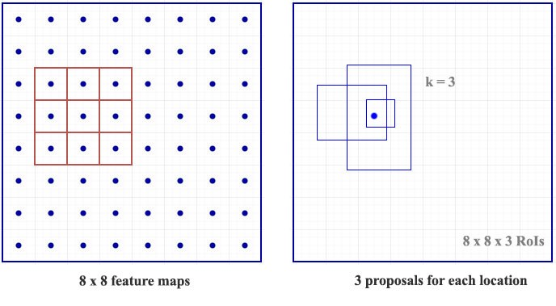
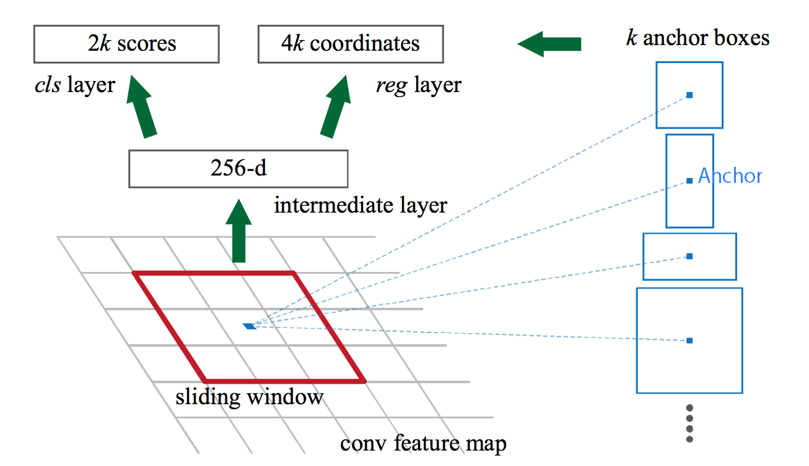
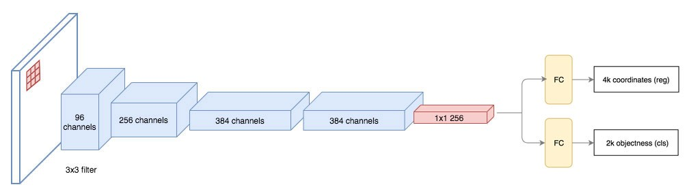

# Fashion Recommendation
- - -
Recently, computer vision applications have attracted significant attention in the fashion domain. A historically challenging task has been to build an intelligent recommender system that can suggest items for purchase, based on a semantically rich notion of “personalized style”. Despite the seemingly insurmountable complexity of this task, the lucrative end reward has enticed e-commerce behemoths like Amazon [1], Stitch Fix, and Pinterest [2] to participate in a race to develop recommender systems that can understand notions of style.

A recent paper describes a system that can take in “in the wild” scene images to generate complementary items recommendations [4]; however, the model training involves inefficient cropping heuristics that fail on certain clothing items, complicated attention mechanisms to detect each item of clothing in an image, and a manually-curated dataset. The authors remark that constructing appropriate ground truth data to learn the notion of compatibility is a significant challenge due to the amount of human effort to label and categorize.

The effort described in this paper aims to use existing methods to provide a quality instance segmentaiton of fashion items and their attributes using data provided from the 2019 Kaggle iMaterialist [6][7] challenge.

This effort focuses on the implementation of a Mask R-CNN model and covers the major components of this framework that deliver a state-of-the-art semantic segmentation.  The Matterport implementation of Mask R-CNN [] is used as a supporting framework to implement the model into which the iMaterialist data is loaded and trained.

A brief discussion on the most recent iteration of this infrastructure, YOLACT, is reviewed where real-time segmentaiton has become a reality.

- - -

## Table of Contents

1. <a href=#sec1>Instance Segmentation Overview</a>
2. <a href=#sec2>Related Work</a>
3. <a href=#sec3>Mask R-CNN Explained</a>
4. <a href=#sec4>Implementation</a>
5. <a href=#sec5>Other Models</a>
6. <a href=#sec6>Lessons Learned / Improvements</a>
7. <a href=#sec7>Conclusion</a>
8. <a href=#sec8>References</a>

- - -

## 1. Instance Segmentation Overview
<a href=#toc>back to table of contents</a> 
Instance segmentation is the task of identifying object outlines at the pixel level. It's one of the most difficult tasks in computer vision. Instance segmentation is challenging because it requires the correct detection of all objects in an image while also precisely segmenting each instance. Figure 1 illustrates the differences between the different computer vision tasks.

 

**Figure 1**: Types of Object detection and segmenation <a href=http://cs231n.github.io/transfer-learning>(http://cs231n.github.io/transfer-learning)</a>  

 

Semantic segmentation has the goal of classify each pixel into a fixed set of categories without differentiating object instances.  Instance segmentation expands on elements from the classical computer vision tasks of object detection but segmenting pixels within each localized bounding box.  

## 2. Related Work
<a href=#toc>back to table of contents</a> 
Object detection has become a primary focus of computer vision tasks over recent years.  In 2015, FaceBook Research introduced DeepMask which was a pioneering effort into instance segmentation.  Less than a year after publishing DeepMask, the same team published an iterative imparovement called SharpMask[14] which addressed many of the DeepMask inaccuracies.  DeepMask and SharpMask did not use skip connections and focused on refining a prposed mask using convolution.  Inference times of the improved SharpMask were ~.8s per frame.  At the same time, the R-CNN family of object detection architectures were under going a series of iterative improvements with the publication of Fast R-CNN and Faster-RCNN.  Although these focused on object detection, they became the precursor to instance segmenation architecture of Mask R-CNN.  The architecture of DeepMask[13] and its successor SharpMask[14] focused on segmenation first and then identifiction which led to a slow training and slow inference as well as a high rate of misclassifications.  Mask R-CNN performs the same task as DeepMask but does so in parallel to the classification task improving both speed and accuracy.

This paper focuses on how Mask R-CNN works and its evolution.

## 3. Mask R-CNN Explained
<a href=#toc>back to table of contents</a> 

### Evolution of Mask R-CNN
Mask R-CNN is the evolution of not a segmentation architecture, but rather the RCNN object detection architecure.  The timeline in Figure 2 shows the papid progress since R-CNN was introduced in 2014 and how it developed into the instance segmentation architecture of Mask R-CNN in 2018.  In 2019, Mask R-CNN was refined by the YOLACT instrastructure which dramatically improved inference time allowing real-time segmenation of images, albeit with lower accuracy.

 

  

**Figure 2**: Mask R-CNN is an iterative evolution of the original R-CNN structure.  YOLACT has recently been developed adding real-time inference to instance segmentaiton tasks.

 

### Mask R-CNN Architecture
The following figure shows the complete Mask R-CNN structure with the Faster R-CNN base separated out.  This shows how Mask R-CNN fits into the R-CNN evolution.  (The evolution before Faster R-CNN is not depicted for understandability.)  The complete Mask R-CNN network (regional convolutional neural network) is a two stage framework: 
1. Stage 1 scans the image and generates proposals(areas likely to contain an object) using a Regiona Proposal Network. 
2. Stage 2 classifies the proposals and generates bounding boxes and masks.

Mask R-CNN contributes to the second stage of this process by creating masks from the Faster R-CNN's Regional Proposal Outputs.

 

**Mask R-CNN Architecture**

**Figure 3**: Mask R-CNN adds segmentation by inserting a process to analyze Faster R-CNN's proposed regions of interest.  
(Source image from <a href=https://medium.com/@jonathan_hui/image-segmentation-with-mask-r-cnn-ebe6d793272>https://medium.com/@jonathan_hui/image-segmentation-with-mask-r-cnn-ebe6d793272</a>)

 

###Network Components
1. Convolutionan Network:
	- Convolutional Base
	- Feature Pyramid Network (FPN)
2. Region proposal network (RPN)
	- Anchors
	- Outputs
	- Architecture
	- RPN and FPN
3. Region of Interest (ROI align)
3. Object detection branch (bounding box and classification)
4. Segmentation branch (pixel-level assignment of classes)

--- 
### 1. Convolutional Network

#### Convolutional Base
Figure 4 depicts the pyramid structure of a CNN network.  Each layer on the left side of the image is convolved reducing the dimensions of the image while increasing its depth.  This has the effect of capturing spatial features of the image while losing surface details.  The left side of the structure leading up to the encoding can be referred to as a convolutional base.

 

  
**Figure 4**: The encoder part of a pyramid network where each level in the pyramid is a   convolution of the previous level increasing the depth but decreasing the x/y dimensions.

 

The convolutional base is refrred to as a backbone when it is imported as a pre-trained network (eg, ResNet50, ResNet101, MobileNet, VGG, etc). These are networks that are pre-trained on a large catalog of images.  These networks can be imported with only the left hald (encoder) part of their network allowing the right side (decoder) to be trained using a custom or different architecture.  

*START proposed removal*  
---
If you are unfamiliar with the details of the convolutional layers, refer to the [Stanford cs231n class course notes](http://cs231n.github.io/convolutional-networks/), with the demo below. Essentially, each "feature map" is constructed by three convolutional filters. The visualization below iterates over the output activations (green), and shows that each element is computed by elementwise multiplying the highlighted input (blue) with the filter (red), summing it up, and then offsetting the result by the bias. Since we have 2 filters (of size 3x3), our output are 2 feature maps. 

 

  
**Figure 5**: Example of how a convolution is calculated.

 

The later convolutional layers generate smaller feature maps yet generate more of them to capture more information. Passing through the backbone network, the image is converted from variable size images to a feature map of shape 32x32x2048

*END proposed removal*  
---

### Feature Pyramid Network

The main purpose of the encoder is to construct feature maps to extract features from images. The early layers detect fine features (edges and corners), and the later layers detect broader features like complete identifiable objects. As each layer increases in depth, the surface dimension gets smaller which essentially trades image surface details for information about the shapes in the image.

We can think of the convolutional base as constructing a pyramid of feature maps (feature pyramid).

 

  
**Figure 6:** Each level of the pyramid decreases its resolution but   increases its ability to recognize features (semantic values) of an image.  
<a href=https://arxiv.org/pdf/1612.03144.pdf>https://arxiv.org/pdf/1612.03144.pdf</a>

 

However, computer vision tasks using only the high level feature maps will suffer in performance for small objects, while the low-level feature maps are not effective for accurate object detection. The feature pyramid network (FPN) takes the feature maps from the backbone and improves the feature extraction by having another pyramid that takes the high level features from the first pyramid and passes them down to lower layers. By doing so, it allows features at every level to access to both lower and higher level features. The conceptual schematic of FPN is below.

 

  
**Figure 7:** Each level of the enocder side of the pyramid shares semantic meaning with the decoder side   of the pyramid in order to help form properly formed segmentations in the final image.

 

The second pyramid consists of layers that are upsampled using the encoded layer of the first pyramid.  The reconstructed layers are semantic strong but the locations of objects are not precise after all the downsampling and upsampling. Therefore, we concatenate feature maps of similar size from the first pyramid to the second pyramid on the right to help the detector to predict the location better. It also acts as skip connections to make training faster.

*START proposed removal*  
---
Below are the detailed layers for the FPN. For the top-down pathway's M5 layer for example, we apply a 1x1 convolution filter and upsample the feature tensor C5 in the bottom-up pyramid using nearest neighbors upsampling, add the result and the corresponding feature map of the same size (C4) together element-wise. Finally, we apply a 3x3 convolution to the merged layer to make them smooth out and "blend" together, reducing the aliasing effect when merged.

 

  
**Figure 8:** 

 
*END proposed removal*  
---

### Region Proposal Network

The region proposal network (RPN) receives the feature maps from the various levels of the feature pyramid. The RPN scans the image in a sliding-window fashion and finds areas that contain objects (region proposals or regions of interest).

#### Anchors
Because scanning each possible region in an image would be computationally expensive, the image is broken down into prescribed regions which are scanned.  The prescribed regions that the RPN scans over are called anchors.
Anchors are boxes distributed over the image area. In the Mask-RCNN implementation, **there are about 200k anchors of different sizes and aspect ratios**. Here, we are just showing one anchor size. Also, **we are showing the anchors on the image, while in practice, the anchors are regions on the feature maps**.This allows the RPN to reuse the extracted features efficiently and avoid duplicate calculations.

 

  
**Figure 9:** An example of anchors of one size in an image.  
<a href=https://engineering.matterport.com/splash-of-color-instance-segmentation-with-mask-r-cnn-and-tensorflow-7c761e238b46>https://engineering.matterport.com/splash-of-color-instance-segmentation-with-mask-r-cnn-and-tensorflow-7c761e238b46</a>

 

#### What does a region proposal consist of?
The RPN slides 3x3 filters over the anchors on the feature maps to make regional proposals, which consist of a **boundary box prediction** via regression (4 x (x,y) coordinates of the bounding box) and an **objectness score** (a binary classification probability between "contains object" and "does not contain object"). 

For each anchor, a series of boxes of different size and aspect ratio are created.  The number of sizes and rations is user defined and represented by `k`.  So from every anchor box a series of boxes are proposed.  Each box will be evaluated for the presence of an object.  Therefore, within one feature map, for each anchor location we will have `4 * k` bounding box coordinates and ` 2 * k` scores. 

The diagram below shows the 8 × 8 feature maps with a 3 × 3 filter, and it outputs a total of 8 × 8 × 3 ROIs (for k = 3). The right side diagram demonstrates the 3 proposals made by a single location.

 

  
**Figure 10** : Regions of interest for each point in a feature mapping 

 

#### Region proposals for each anchor of different sizes and aspect ratios

To summarize, Mask-RCNN's RPN component uses 9 anchor boxes: 3 different scales at 3 different aspect ratio. These anchors are diverse and cover real-life objects at different scales and aspect ratios reasonable well. This guides the initial training with better guesses and allows each prediction to specialize in a certain shape. This strategy makes early training more stable and easier.

Using 9 anchors per location, it generates 2 × 9 objectness scores and 4 × 9 coordinates per location. The outputs are **regions of interests (ROI)** 

 

  
**Figure 11:** Calculation of scores and coordinates for each anchor.  
<a href=https://medium.com/@jonathan_hui/what-do-we-learn-from-region-based-object-detectors-faster-r-cnn-r-fcn-fpn-7e354377a7c9>https://medium.com/@jonathan_hui/what-do-we-learn-from-region-based-object-detectors-faster-r-cnn-r-fcn-fpn-7e354377a7c9</a>

 

#### RPN architecture
The regression task for bounding box and classification task for "has object or not" can be achieved by standard convolutional layers, followed by two fully connected heads: one for bounding box regression and the other for classification.  Figure 12 depicts the Region Proposal Network on the left and how it creates proposed regions with bounding boxes and scores for each box.  Note that only the last layers of the Feature Pyramid is evaluated.

 

  
**Figure 12:** The RPN uses scores and coordinates to determine classes and bounding boxes.  
<a href=https://medium.com/@jonathan_hui/what-do-we-learn-from-region-based-object-detectors-faster-r-cnn-r-fcn-fpn-7e354377a7c9>https://medium.com/@jonathan_hui/what-do-we-learn-from-region-based-object-detectors-faster-r-cnn-r-fcn-fpn-7e354377a7c9</a>

 

#### Connecting RPN and FPN

Once proposed regions are generated, each is evaluated for the possible existence of an object.  Once these are selected, respective regions from the other pyramid scale levels are selected that best represent the object based on its size/scale.  The result is a composite feature map with different regions being patches from different-scale layers of the top-down feature pyramid.

 

  
**Figure 13:** Mask R-CNN inserts an ROI Pooling layer in the model   before classification and bounding boxes are calculated.  
<a href=https://medium.com/@jonathan_hui/understanding-feature-pyramid-networks-for-object-detection-fpn-45b227b9106c>https://medium.com/@jonathan_hui/understanding-feature-pyramid-networks-for-object-detection-fpn-45b227b9106c</a>

 

The formula to pick the feature maps is based on the width w and height h of the ROI.

where k0 is a user-defined parameter (default: 4), and k is the layer in the FPN to be used for the feature patch. So if k = 3, we select P3 for the patch for that ROI.

#### ROI Align
The next phase is the contribution made my the Mask R-CNN architecture.  Chosen feature maps with possible objects are further refined in the ROI pooling layer.  The results are sent down 3 branches of the network:

1. Classification
   * The same classification process is done here as is done with Faster R-CNN.  The probability of classification is calculated.
2. Bounding Box Regression
   * The bounding boxes are refined using regression
3. Mask
   * Each pixels is evaluated for inclusion in a classification mask.  This is process intensive addition to the faster R-CNN process which increases train and inference time.

Each branch produces a unique output.

## 4. Implementation
<a href=#toc>back to table of contents</a> 

In order to demonstrate Mask R-CNN the Matterport implementation was used.  This provided a structure into which the iMaterialist Kaggle data could be loaded and trained.

### Data Preparation / EDA
The Kaggle data consists of 46715 labeled training images and 3201 unlabeled test images.  Labels are encoded pixel masks saved in a training Excel spreadsheet that included image filename, the encoded mask and the class in the mask.

Data from the Excel sheet was extracted and loaded into a Dataset class provided by the Matterport implementation.  The Dataset class provides a structure to hold references to images and masks as well as a variety of methods which are used to handle images and masks during training and inference.  Using this Dataset class enabled seamless training using the Mask R-CNN structure supported by the Matterport implementation.

Upon inspection, we found the data to be clean with no requirements to remove images or resolve naming conflicts.

### Results
We trained the dataset using an <NVIDIA 16GB EGPU> and still needed to limit batch sizes to prevent memory faults.  The images below are the r

BACKBONE: resnet50

## 5. Other Models
<a href=#toc>back to table of contents</a> 

In order to extend our dataset to other models, we made attempts to train a UNET and YOLACT model in order to compare and contrast with Mask RCNN.  Unfortuntately, this proved more challenging than expected:

#### UNET
Although UNET will only provide segmentation and not instance segmenation, we felt that the comparison of a raw model implementation without using a pre-existing implementaiotn would be a useful exercise.  We started with the DataSet object from our Matterport Mask RCNN implementation in order to ensure we were trianing on the exact same data and data configuration.  The Unet model structure is standard except we added BatchNormalization to each layer.  We tried training from scratch as well as with pre-trained weights.  Both versions were trained with the entire dataset in each epoch.  

|                            | Scratch              | ResNet50 Pre-Trained |
| -------------------------- | -------------------: | -------------------: |
|Epochs                      |                      |                      |
|Final Loss                  |                      |                      |   
|Final Accuracy (Train)      |         %            |            %         |
|Final Accuracy (Validation) |         %            |            %         |

Results

#### YOLACT
As YOLACT was published during our initial project, only one stable implementation was available to use to try.  We did not attempt to build our own YOLACT implementation.  We were not successful in getting the model to work
(<a href=https://github.com/dbolya/yolact>https://github.com/dbolya/yolact</a>)

## 6. Lessons Learned / Improvements
<a href=#toc>back to table of contents</a> 

* Starting with a pre-created implementation of an architecture is imperative.  

## 7. Conclusion
<a href=#toc>back to table of contents</a> 

<a name=sec8>
## 8. References
<a href=#toc>back to table of contents</a> 

[1]  Krishnan, A. (2019, June 19). StyleSnap will change the way you shop, forever. Retrieved from aboutamazon.com  
[2]  Le, J. (2018, January 14). Pinterest's Visual Lens: How computer vision explores your taste. Retrieved from . Medium.com. 
[3]  Kang, W.-C., Fang, C., Wang, Z., & Mcauley, J. (2017). Visually-Aware Fashion Recommendation and Design with Generative Image Models. 2017 IEEE International Conference on Data Mining (ICDM). doi: 10.1109/icdm.2017.30 
[4]  Kang, W.-C., Kim E., Leskovec J., Rosenberg C., McAuley J.. Complete the Look: Scene-based Complementary Product Recommendation. 
[5]  Veit, A., Kovacs, B., Bell, S., Mcauley, J., Bala, K., & Belongie, S. (2015). Learning Visual Clothing Style with Heterogeneous Dyadic Co-Occurrences. 2015 IEEE International Conference on Computer Vision (ICCV). doi: 10.1109/iccv.2015.527 
[6]  Visipedia. (2019, June 26). visipedia/imat_comp. Retrieved from https://github.com/visipedia/imat_comp. 
[7]  iMaterialist (Fashion) 2019 at FGVC6. (n.d.). Retrieved from https://www.kaggle.com/c/imaterialist-fashion-2019-FGVC6. 
[8]  Kang W., Yang Q.,  Liang R. (2009). The Comparative Research on Image Segmentation Algorithms. IEEE Conference on ETCS. doi: 10.1109/ETCS.2009.417 
[9]  He, K., Gkioxari, G., Dollar, P., & Girshick, R. (2017). Mask R-CNN. 2017 IEEE International Conference on Computer Vision (ICCV). doi: 10.1109/iccv.2017.322 
[10] Lin, T.-Y., Maire, M., Belongie, S., Hays, J., Perona, P., Ramanan, D., Zitnick, C. L. (2014). Microsoft COCO: Common Objects in Context. Computer Vision – ECCV 2014 Lecture Notes in Computer Science, 740–755. doi: 10.1007/978-3-319-10602-1\_48 
[11] iMaterialist (Fashion) 2019 at FGVC6. (n.d.). Retrieved from https://www.kaggle.com/c/imaterialist-fashion-2019-FGVC6/overview/evaluation. 
[12] Mask R-CNN for Object Detection and Segmentation https://github.com/matterport/Mask_RCNN 
[13] Learning to Segment Object Candidates, Sept 2015, Pedro O. Pinheiro∗ Ronan Collobert Piotr Dollar, Facebook AI Research (FAIR), https://arxiv.org/pdf/1506.06204.pdf  
[14] Learnign to Refine Object Segments July 2016, Pedro O. Pinheiro⋆, Tsung-Yi Lin⋆, Ronan Collobert, Piotr Dollar, Facebook AI Research (FAIR), https://arxiv.org/pdf/1603.08695.pdf