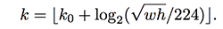

## Instance segmentation
Instance segmentation is the task of identifying object outlines at the pixel level. It's one of the most difficult tasks in computer vision. Instance segmentation is challenging because it requires
the correct detection of all objects in an image while also precisely segmenting each instance. The image below illustrates the differences between the different computer vision tasks

http://cs231n.github.io/transfer-learning/#tf

Instance segmentation, therefore, combines elements from the classical computer vision tasks of object detection, where the goal is to classify individual objects and localize each using a bounding box, and semantic segmentation, where the goal is to classify each pixel into a fixed set of categories without differentiating object instances.

## Mask-RCNN

Mask R-CNN (regional convolutional neural network) is a two stage framework: the first stage scans the image and generates proposals(areas likely to contain an object). And the second stage classifies the proposals and generates bounding boxes and masks.

Mask-RCNN can be decomposed into the following components, which we will explain in detail how each works.

(Image from https://medium.com/@jonathan_hui/image-segmentation-with-mask-r-cnn-ebe6d793272)

1. Backbone: Feature extractor
	- Convolutional Base
	- Feature Pyramid Network (FPN)
2. Region proposal network (RPN)
	- Anchors
	- Outputs
	- Architecture
	- RPN and FPN
3. Region of Interest (ROI align)
3. Object detection branch (bounding box and classification)
4. Segmentation branch (pixel-level assignment of classes)

--- 
### 1. Backbone

#### Convolutional Base

The backbone is a standard convolutional neural network (ResNet50 or ResNet101). The main purpose of the backbone is to construct feature maps to extract details that are important for the inference task at hand. The early layers detect low level features (edges and corners), and the later features detect higher level features (objects). 

If you are unfamiliar with the details of the convolutional layers, refer to the [Stanford cs231n class course notes](http://cs231n.github.io/convolutional-networks/), with the demo below. Essentially, each "feature map" is constructed by three convolutional filters. The visualization below iterates over the output activations (green), and shows that each element is computed by elementwise multiplying the highlighted input (blue) with the filter (red), summing it up, and then offsetting the result by the bias. Since we have 2 filters (of size 3x3), our output are 2 feature maps. 

The later convolutional layers generate smaller feature maps yet generate more of them to capture more information. Passing through the backbone network, the image is converted from variable size images to a feature map of shape 32x32x2048

### Feature pyramid network

We can think of the convolutional base as constructing a pyramid of feature maps (feature pyramid), with the higher level being smaller than the previous.

https://arxiv.org/pdf/1612.03144.pdf

However, computer vision tasks using only the high level feature maps will suffer in performance for small objects, while the low-level feature maps are not effective for accurate object detection. The feature pyramid network (FPN) takes the feature maps from the backbone and improves the feature extraction by having another pyramid that takes the high level features from the first pyramid and passes them down to lower layers. By doing so, it allows features at every level to access to both lower and higher level features. The conceptual schematic of FPN is below.

The second pyramid consists of layers that are upsampled using the highest layer of the first pyramid.  The reconstructed layers are semantic strong but the locations of objects are not precise after all the downsampling and upsampling. Therefore , we concatenate feature maps of similar size from the first pyramid to the second pyramid on the right to help the detector to predict the location betters. It also acts as skip connections to make training easier (similar to what ResNet does).

Below is the detailed layers for the FPN. For the top-down pathway's M5 layer for example, we apply a 1x1 convolution filter and upsample the feature tensor C5 in the bottom-up pyramid using nearest neighbors upsampling, add the result and the corresponding feature map of the same size (C4) together element-wise. Finally, we apply a 3x3 convolution to the merged layer to make them smooth out and "blend" together, reducing the aliasing effect when merged.

### Region proposal network

The region proposal network (RPN) receives the feature maps of different scales from the FPN. The RPN scans the image in a sliding-window fashion and finds areas that contain objects (region proposals or regions of interest).

#### Anchors
The regions that the RPN scans over are called anchors.
Anchors are boxes distributed over the image area. In the Mask-RCNN implementation, **there are about 200k anchors of different sizes and aspect ratios**. Here, we are just showing one anchor size. Also, **we are showing the anchors on the image, while in practice, the anchors are regions on the feature maps**.This allows the RPN to reuse the extracted features efficiently and avoid duplicate calculations.

https://engineering.matterport.com/splash-of-color-instance-segmentation-with-mask-r-cnn-and-tensorflow-7c761e238b46

#### What does a region proposal consist of?
The RPN slides 3x3 filters over the anchors on the feature maps to make regional proposals, which consist of a **boundary box prediction** via regression - 4 (x,y) coordinates of the bounding box - and an **objectness score** - a binary classification probability between "have an object" and "background". 

For each location in the feature maps, the RPN makes k guesses (a user-defined parameter). Therefore, within one feature map, for each location we will have `4 * k` bounding box coordinates and ` 2 * k` scores. 

The diagram below shows the 8 × 8 feature maps with a 3× 3 filter, and it outputs a total of 8 × 8 × 3 ROIs (for k = 3). The right side diagram demonstrates the 3 proposals made by a single location.

#### Region proposals for each anchor of different sizes and aspect ratios

To summarize, Mask-RCNN's RPN component uses 9 anchor boxes: 3 different scales at 3 different aspect ratio. These anchors are diverse and cover real-life objects at different scales and aspect ratios reasonable well. This guides the initial training with better guesses and allows each prediction to specialize in a certain shape. This strategy makes early training more stable and easier.

Using 9 anchors per location, it generates 2 × 9 objectness scores and 4 × 9 coordinates per location. The outputs are **regions of interests (ROI)** 

https://medium.com/@jonathan_hui/what-do-we-learn-from-region-based-object-detectors-faster-r-cnn-r-fcn-fpn-7e354377a7c9

#### RPN architecture
The regression task for bounding box and classification task for "has object or not" can be achieved by standard convolutional layers, followed by two fully connected heads: one for bounding box regression and the other for classification.

https://medium.com/@jonathan_hui/what-do-we-learn-from-region-based-object-detectors-faster-r-cnn-r-fcn-fpn-7e354377a7c9

#### Connecting RPN and FPN

As described above RPN generate region of interests. We feed **only the lowest-level (same size as image) feature map** from the FPN to the RPN. After we use the RPN to generate regions of interests on that one feature map, we **select patches from different layers of the feature pyramid from FPN**. For each ROI, based on the size of the ROI, we select the feature map layer in the most proper scale to extract the feature patches. The result is a composite feature map with different regions being patches from different-scale layers of the top-down feature pyramid.

https://medium.com/@jonathan_hui/understanding-feature-pyramid-networks-for-object-detection-fpn-45b227b9106c

The formula to pick the feature maps is based on the width w and height h of the ROI.

where k0 is a user-defined parameter (default: 4), and k is the layer in the FPN to be used for the feature patch. So if k = 3, we select P3 for the patch for that ROI.

